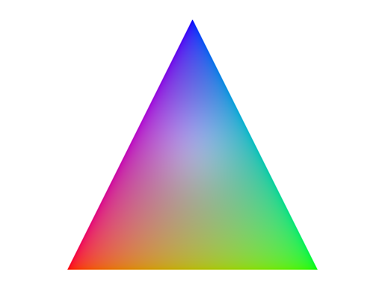

# Custom Geometry

This is an example of a custom geometry written as an answer on this stackoverflow [question](https://stackoverflow.com/questions/73987125/implementing-rgb-in-qml-using-qt3d). It shows how to use `ColorSemantic` attribute to create a vertex buffer with per vertex color. It is a stripped down version of the [Qt Quick 3D - Custom Geometry Example](https://doc.qt.io/qt-6/qtquick3d-customgeometry-example.html).

